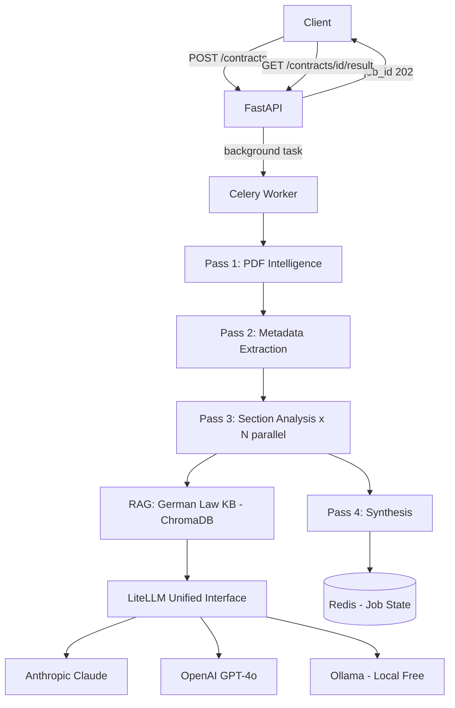

# Contract Analyzer API

An LLM-powered REST API that analyzes any contract PDF — rental, employment, freelance, gym, insurance — in any language (especially German) and returns structured risk flags with legal citations, plain-language explanations, and negotiation suggestions.

Built as a portfolio project to demonstrate Python + AI engineering skills.

---

## What it does

Upload a PDF contract. Get back:

- **Risk flags** with precise legal classification:
  - `void` — already unenforceable by German law (BGB §307, BGH rulings) — you can safely ignore it
  - `voidable` — enforceable unless you challenge it
  - `unfavorable_but_valid` — legally binding, must negotiate before signing
- **Plain-language explanations** — "this means if you leave early, you owe 3 months rent"
- **Negotiation suggestions** — exact replacement wording in the contract's language
- **Missing clause detection** — legally required clauses that are absent
- **Follow-up Q&A** — ask questions about specific clauses

---

## Architecture



### Multi-pass pipeline

| Pass | What it does | LLM calls |
|------|-------------|-----------|
| 1 | PDF extraction — pdfplumber → pypdf → OCR fallback | 0 |
| 2 | Metadata: parties, dates, amounts, contract type | 1 |
| 3 | Per-section risk analysis with RAG legal context | N (parallel) |
| 4 | Synthesis: contradictions, missing clauses, priority actions | 1 |

---

## Quick Start

### Option A: Ollama (free, local, no API key)

```bash
# Prerequisites: Docker Desktop + Ollama
brew install ollama
ollama pull llama3.2
ollama serve

# Clone and start
git clone https://github.com/YOUR_USERNAME/contract-analyzer
cd contract-analyzer
cp .env.example .env

python -m venv venv && source venv/bin/activate
pip install -r requirements-dev.txt

python scripts/index_legal_docs.py   # Index legal knowledge base (once)

uvicorn app.main:app --reload --port 8000
```

Analyze a contract:
```bash
curl -X POST http://localhost:8000/api/v1/contracts \
  -H "X-LLM-Provider: ollama" \
  -F "file=@my_rental_contract.pdf" \
  -F "language=en"

# Returns: {"job_id": "job_abc123", "status": "queued"}

curl http://localhost:8000/api/v1/contracts/job_abc123/result
```

### Option B: Claude (best quality, requires API key)

```bash
curl -X POST http://localhost:8000/api/v1/contracts \
  -H "X-LLM-Provider: claude" \
  -H "X-API-Key: sk-ant-YOUR_KEY" \
  -F "file=@mietvertrag.pdf" \
  -F "language=en"
```

### Option C: Full Docker stack

```bash
make build
make prod
make setup-ollama   # first time only

open http://localhost:8000/docs   # Swagger UI
```

---

## API Reference

| Method | Endpoint | Description |
|--------|----------|-------------|
| `POST` | `/api/v1/contracts` | Upload PDF, start analysis. Returns `job_id`. |
| `GET`  | `/api/v1/contracts/{id}/status` | Poll analysis progress. |
| `GET`  | `/api/v1/contracts/{id}/result` | Get full `AnalysisResult`. |
| `POST` | `/api/v1/contracts/{id}/messages` | Ask follow-up questions about the contract. |
| `POST` | `/api/v1/contracts/estimate` | Estimate token count + cost before analysis. |
| `GET`  | `/api/v1/health` | Health check. |
| `GET`  | `/api/v1/health/providers` | List available LLM providers and capabilities. |

### Request headers

| Header | Values | Required |
|--------|--------|----------|
| `X-LLM-Provider` | `claude`, `openai`, `gemini`, `ollama` | No (default: `ollama`) |
| `X-API-Key` | Your API key | For claude/openai/gemini |

### Example response — `AnalysisResult`

```json
{
  "analysis_id": "ana_a1b2c3d4e5f6",
  "contract_type": "rental",
  "detected_language": "de",
  "overall_risk": "high",
  "parties": {
    "first_party": "Max Mustermann (Mieter)",
    "second_party": "ABC Immobilien GmbH (Vermieter)"
  },
  "key_terms": {
    "start_date": "2026-06-01",
    "monthly_amount": "1200 EUR",
    "deposit": "3600 EUR",
    "notice_period": "3 Monate"
  },
  "flags": [
    {
      "severity": "red",
      "legal_status": "void",
      "category": "repairs",
      "title": "Rigid Cosmetic Repair Schedule",
      "explanation": "Clause requires repainting every 3 years regardless of actual condition.",
      "what_this_means": "You may be charged for repairs even if the apartment is in good condition.",
      "legal_source": "BGH VIII ZR 215/12",
      "action": "none_required",
      "negotiation_suggestion": null
    }
  ],
  "priority_actions": [
    "No action needed on the repair clause — it is void by BGH case law",
    "Verify deposit is exactly 3x Kaltmiete (BGB §551)"
  ],
  "summary_plain": "Standard rental contract. The cosmetic repair clause is void by law — you cannot be charged for it. The deposit is within legal limits."
}
```

---

## Supported Providers

| Provider | Native PDF | Requires Key | Best For |
|----------|-----------|-------------|---------|
| `ollama` | No | No (free) | Development, privacy |
| `claude` | Yes (direct PDF) | Yes | Best analysis quality |
| `openai` | No (text extraction) | Yes | GPT-4o quality |
| `gemini` | No (text extraction) | Yes | Cost efficiency |

---

## Technical Decisions

| Decision | Choice | Why |
|----------|--------|-----|
| Multi-pass pipeline | 4 passes | Focused prompts outperform single large-context calls |
| Provider abstraction | LiteLLM | One interface for all providers, swap with one config change |
| BYOK architecture | User supplies API key per-request | Zero infra cost; used in real products (Cursor, OpenRouter) |
| Async jobs | `asyncio.create_task()` → Celery | In-process for dev, process-isolated for production |
| RAG | ChromaDB + `paraphrase-multilingual-MiniLM-L12-v2` | Bilingual (DE+EN), no external API needed for embeddings |
| Parallelism | `asyncio.gather()` + `Semaphore(5)` | All sections analyzed simultaneously, rate-limit safe |
| JSON parsing | 3-layer fallback | LLMs don't reliably return clean JSON even when instructed |
| Error hierarchy | Domain exceptions → HTTP codes | Business logic never raises raw HTTP errors |

---

## German Law Knowledge Base

The RAG knowledge base includes:

| Source | Contract type | What it covers |
|--------|-------------|----------------|
| BGB §307 | All | Unfair standard terms — basis for voiding clauses |
| BGB §551 | Rental | Deposit cap = 3× Kaltmiete |
| BGB §573c | Rental | Tenant notice minimum = 3 months |
| BGH VIII ZR 215/12 | Rental | Rigid cosmetic repair schedules = **void** |
| HGB §74 | Employment | Non-compete requires 50% compensation |
| GDPR Art. 6 | Employment | Consent-based employee data processing = invalid |

---

## Running Tests

```bash
pytest tests/ -v                        # all tests
pytest tests/unit/ -v                   # unit tests only (no network)
pytest --cov=app --cov-report=html      # with coverage report
open htmlcov/index.html
```

---

## Project Structure

```
app/
├── api/v1/
│   ├── contracts.py     # POST /contracts, GET /status, GET /result, POST /messages
│   └── health.py        # GET /health, GET /health/providers
├── models/
│   ├── requests.py      # Input validation (Pydantic)
│   └── responses.py     # Output shapes (Pydantic) — auto-generates Swagger docs
├── services/
│   ├── analysis_service.py   # 4-pass pipeline orchestrator
│   ├── pdf_service.py        # PDF extraction (pdfplumber → pypdf → OCR)
│   ├── llm_service.py        # LiteLLM wrapper + BYOK injection
│   └── prompt_service.py     # Prompt builders + multi-layer JSON parser
├── providers/
│   └── registry.py      # Provider capabilities + LiteLLM prefix map
├── legal/
│   └── knowledge_base.py     # ChromaDB RAG retrieval
└── workers/
    ├── celery_app.py    # Celery instance (Redis broker + backend)
    └── tasks.py         # analyze_contract_task (production async jobs)
```

---

## Author

**Amir** — transitioning from Ruby on Rails to Python AI/LLM engineering.

This project demonstrates: FastAPI, async Python, LiteLLM multi-provider, RAG (ChromaDB), Celery, prompt engineering, Pydantic v2, Docker multi-stage builds, GitHub Actions CI.
